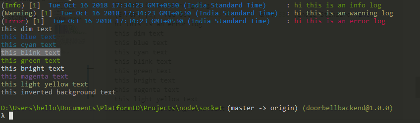

# **Rainbow_Chalk**

 A package to color the text and create timestamped logs string

## To install rainbow_chalk module

> `npm i rainbow_chalk`

## To require the rainbow_chalk module

``` javascript
var  rainbow  =  require('rainbow_chalk');
```

## To Instantiate the Rainbow_Chalk object

``` javascript
var  myRainbow  =  new  rainbow.Rainbow();
```

## To generate timeStamped logs

``` javascript
console.log(myRainbow.info("hi this is an info log"));
console.log(myRainbow.warn("hi this is an warning log"));
console.log(myRainbow.error("hi this is an error log"));
```

## To generate colored string

``` javascript
console.log(myRainbow.dim("this dim text"));
console.log(myRainbow.blue("this blue text"));
console.log(myRainbow.cyan("this cyan text"));
console.log(myRainbow.blink("this blink text"));
console.log(myRainbow.green("this green text"));
console.log(myRainbow.bright("this bright text"));
console.log(myRainbow.magenta("this magenta text"));
console.log(myRainbow.lightYellow("this light yellow text"));
console.log(myRainbow.invertBg("this inverted background text"));
```

## **Output will be**

> ## **Result**
>
